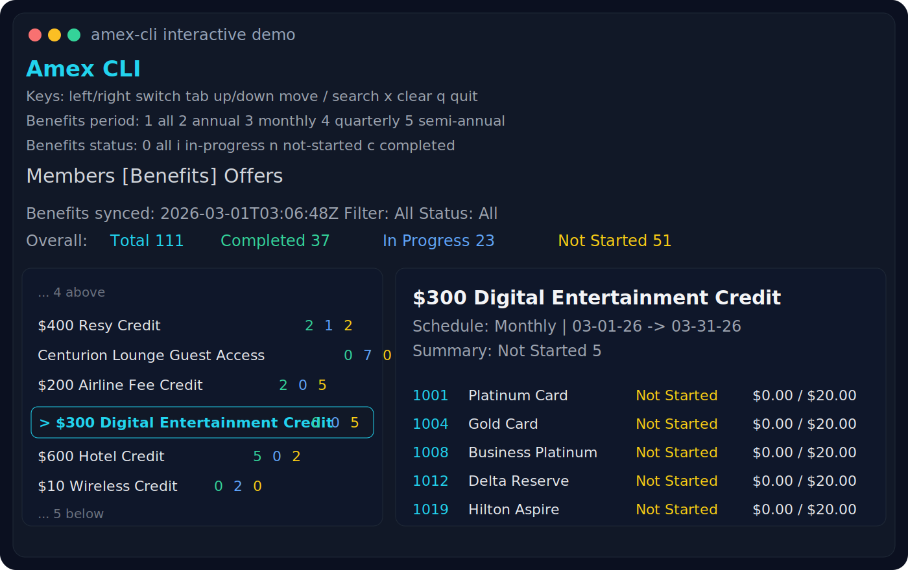

# amex-cli

`amex-cli` is a local-first CLI for syncing American Express card data into structured JSON that works well for both humans and AI tools.



GitHub: [kevchentw/amex-cli](https://github.com/kevchentw/amex-cli)

It opens Chrome, signs in to Amex, syncs your cached data locally, and gives you two ways to work with it:

- interactive terminal UI for browsing cards, benefits, and offers
- JSON output for agents, scripts, MCP-style tools, and LLM workflows

## Why this exists

Most Amex data is easy to view in the website, but hard to reuse.

`amex-cli` makes that data:

- local
- scriptable
- AI-friendly
- easy to inspect without logging into the website every time

Typical use cases:

- ask an AI assistant to summarize active benefits you have not used
- filter all offers for a specific card and pass them into another tool
- keep a local cache of cards, benefits, and offers for later analysis
- browse everything in a terminal UI without digging through multiple Amex pages

## What it syncs

One sync pulls:

- cards
- benefits
- offers

The synced results are saved locally as JSON:

- `~/.amex-cli/cache/cards.json`
- `~/.amex-cli/cache/benefits.json`
- `~/.amex-cli/cache/offers.json`

`browser-profile/` is also stored locally and reused for future login sessions:

- `~/.amex-cli/browser-profile/`

You can override the default location with:

```bash
AMEX_CLI_HOME=/custom/path
```

## Install

Requirements:

- Node.js 20+
- Google Chrome installed

Run directly with `npx`:

```bash
npx amex-cli --help
```

## Quick Start

Store your Amex credentials in the system credential manager:

```bash
npx amex-cli auth set
```

Or use non-interactive CLI arguments:

```bash
npx amex-cli auth set --username YOUR_USERNAME --password YOUR_PASSWORD
```

Run a sync:

```bash
npx amex-cli sync
```

`sync` currently opens a visible Chrome window for login because the Amex sign-in flow is not reliable in pure headless mode yet.

Open the interactive app:

```bash
npx amex-cli
```

Or explicitly:

```bash
npx amex-cli interactive
```

## Commands

Main commands:

```bash
npx amex-cli
npx amex-cli interactive
npx amex-cli sync
npx amex-cli sync --debug
npx amex-cli show cards
npx amex-cli show benefits
npx amex-cli show offers
npx amex-cli show all
npx amex-cli auth set
npx amex-cli auth set --username YOUR_USERNAME --password YOUR_PASSWORD
npx amex-cli auth status
npx amex-cli auth clear
```

Notes:

- running `npx amex-cli` with no command opens the interactive UI
- `sync` opens a visible Chrome window for login and refreshes local cache
- `sync --debug` keeps the browser visible and prints extra auth/network logs

## Interactive UI

The interactive UI includes:

- `Members` tab
- `Benefits` tab
- `Offers` tab

It supports keyboard navigation, filtering, and search directly in the terminal.

## AI-Friendly Output

The project is designed to work well with AI tools.

Use JSON output when you want another tool or agent to read the synced data:

```bash
npx amex-cli show cards --json
npx amex-cli show benefits --json
npx amex-cli show offers --json
npx amex-cli show all --json
```

This makes it easy to plug into:

- local agents
- CLI pipelines
- prompt-based analysis
- notebooks
- custom dashboards

Example workflows:

```bash
npx amex-cli show benefits --json > benefits.json
npx amex-cli show offers --json > offers.json
```

Then ask an AI tool to:

- identify unused statement credits
- summarize enrolled or eligible offers
- generate a weekly action list

## Security Model

Credentials are stored with [`keytar`](https://github.com/atom/node-keytar), which uses the OS credential store:

- macOS Keychain
- Windows Credential Manager
- Secret Service / libsecret on Linux

This avoids storing your Amex username and password in plain text files.

If you use `auth set --password ...`, note that the password may be saved in your shell history. The interactive `auth set` prompt is safer for normal use.

The browser profile is stored locally so Chrome can retain cookies, trusted-device state, and related browser storage between sync runs.

## Login Behavior

Login uses Patchright with a persistent Chrome profile.

Current behavior:

- sync uses a real browser profile
- sync currently relies on a visible, non-headless Chrome session
- headless login still has reliability issues during the Amex sign-in flow and is not supported yet
- two-step verification may be required during login
- MFA is supported in the visible browser flow
- trusted-device state can be reused across runs through the saved browser profile

At the moment, pure headless sign-in is not reliable enough for normal use. The goal is to support a fully headless flow in the future, but the current Amex login experience still requires a visible browser session.

If Amex changes their login flow, device checks, or bot detection, login behavior may also change.

## Data Shape

Each synced dataset is stored as structured JSON with a consistent wrapper:

```json
{
  "syncedAt": "2026-03-01T03:06:49.359Z",
  "source": "...",
  "items": [],
  "raw": {}
}
```

This is useful for both:

- human-readable CLI views
- machine-readable downstream processing

## Current Status

Implemented today:

- Amex login through Patchright + Chrome profile
- local JSON cache for cards, benefits, and offers
- interactive terminal UI
- human-readable CLI views
- JSON output for automation and AI use

## Example AI Prompts

Once you have synced data locally, you can hand JSON to an AI assistant and ask things like:

- "Which benefits are in progress and likely worth using this month?"
- "Show me enrolled offers that expire soon."
- "Which cards have overlapping offers?"
- "Create a weekly summary of unused Amex benefits."
- "Find statement credits I have not started but should use before month-end."

## Disclaimer

This project is an independent tool and is not affiliated with or endorsed by American Express.

It is also a vibe-coded project. Use it at your own risk.

You are responsible for reviewing the code, protecting your credentials, and deciding whether it is appropriate for your own account and environment.
